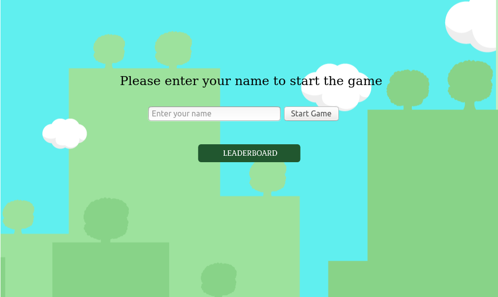
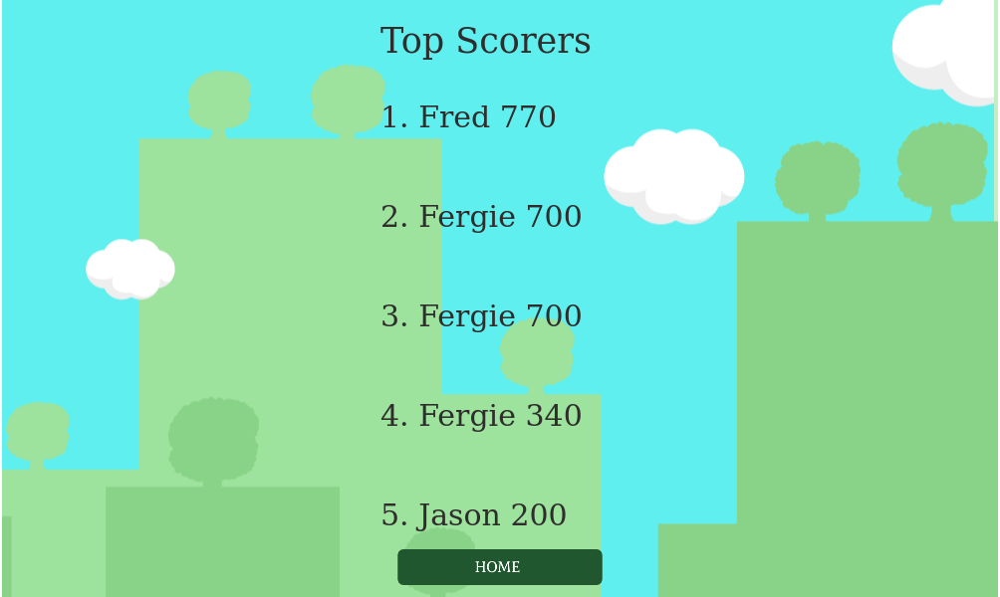
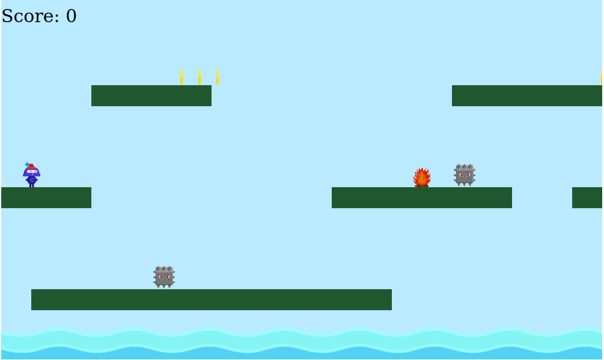
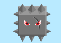

[![Contributors][contributors-shield]][contributors-url]
[![Issues][issues-shield]][issues-url]
 

 
  <h2 align="center">Endless Runner</h2>
  

     
    <a href="https://github.com/fegzycole/Javascript-Capstone"><strong>Explore the docs »</strong></a>
     
     
    ·
    <a href="https://github.com/fegzycole/Javascript-Capstone/issues">Report Bug</a>
    ·
    <a href="https://github.com/fegzycole/Javascript-Capstone/issues">Request Feature</a>
  

<!-- TABLE OF CONTENTS -->
## Table of Contents

* [About the Project](#about-the-project)
  * [Built With](#built-with)
  * [Prerequisites](#prerequisites)
* [Credit](#credit)
* [Screenshots](#screenshots)
* [Roadmap](#roadmap)
* [License](#license)
* [Contact](#contact)

<!-- ABOUT THE PROJECT -->
## About The Project

An endless runner platform game where the main character has to evade the fire, the ocean and the mace, obtain coins and make his way to the beautiful gate.

### Built With

This project was Phaser.js, a 2D game framework for making HTML5 games for desktop and mobile.

## Prerequisites
 - Git
 - Node.js
 - NPM

## Screenshots

### Welcome Scene

### Leaderboard Scene

### Game Scene

### Characters

- Hero  main character of the game, he is on a quest to discover the hidden city.

- Mace  certified bad boy, it moves left and right and with its sharp edges is capable of fatally wounding our hero.

- Fire  static but deadly, don't come too close or you won't be alive to tell the tale.

- Water  Who doesn't like a good ol swim? I'll tell you who, our hero doesn't, he's afraid of the water, try not to send him into the deep please, will you?

- Coins  Shiny and sparkly, collect as much of it as you can.

### H

## Getting Started

- git clone https://github.com/fegzycole/Rails-capstone.git

- cd Rails-capstone

- bundle update

- bundle install

- rails db:create

- rails db:migrate (to add tables and columns)

- rails server to fire the rails server

## Live Version

- You can view the app [Here](https://secure-shelf-49955.herokuapp.com/)

<!-- ROADMAP -->
## Roadmap

See the [open issues](https://github.com/fegzycole/Rails-capstone/issues) for a list of proposed features (and known issues).

<!-- LICENSE -->
## License

Distributed under the MIT License. See `LICENSE` for more information.

<!-- CONTACT -->
## Contact
Ferguson Iyara - [Github profile](https://github.com/fegzycole)

Project Link: [Project repo](https://github.com/fegzycole/Rails-capstone)

<!-- MARKDOWN LINKS & IMAGES -->
<!-- https://www.markdownguide.org/basic-syntax/#reference-style-links -->
[contributors-shield]: https://img.shields.io/badge/Contributors-1-%2300ff00
[contributors-url]: https://github.com/fegzycole/Rails-capstone/graphs/contributors
[issues-shield]: https://img.shields.io/badge/issues-0-%2300ff00
[issues-url]: https://github.com/fegzycole/Rails-capstone/issues/